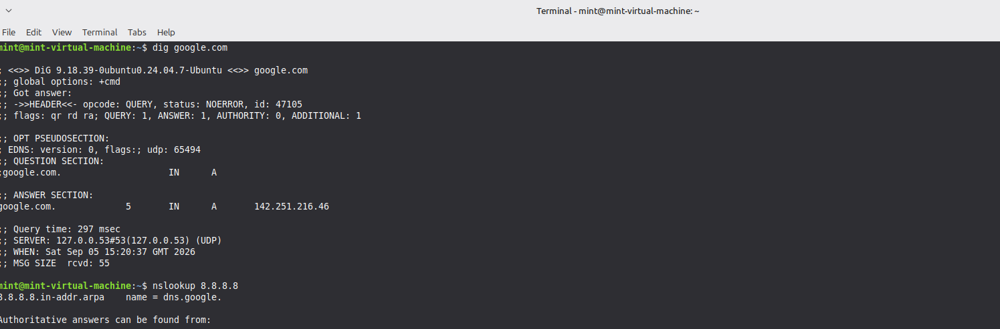
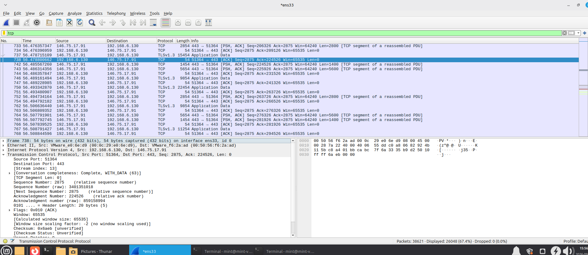
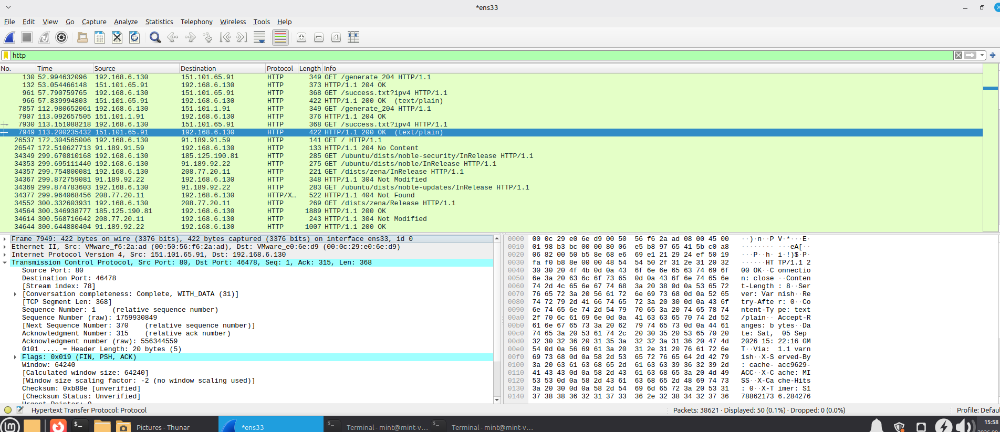
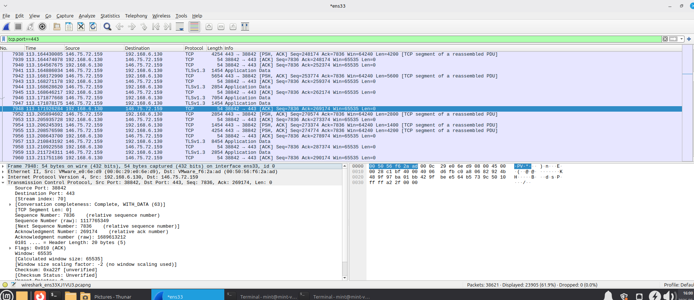

# Packet Capture and Protocol Identification Via Wireshark

* **Operating System:** Linux Mint
* **Active Network Interface:** `ens33`
* **Lab Host IP Address:** `192.168.6.130`

---

## 1. Introduction & Environment Setup
This laboratory exercise captures, inspects, and analyzes live network traffic patterns generated on a Linux Mint host machine [INDEX]. Using **Wireshark** to monitor the virtual interface `ens33` and terminal networking utilities (`dig`), traffic was recorded across three architectural pillars: domain name resolution (DNS), connection state management (TCP), and web application transactions (HTTP vs. HTTPS) [INDEX].

---

## 2. Domain Name System (DNS) Analysis
* **Command Executed:** `dig google.com`

### Captured Traffic Details (Frame 797)
* **Source IP:** `192.168.6.130` (Linux Mint Host)
* **Destination IP:** `192.168.6.2` (Local DNS Resolver / Gateway)
* **Source Port:** `41847` (Random High Port)
* **Destination Port:** `53` (Standard DNS Service Port)
* **Protocol:** UDP

### Protocol Behavior
The client machine generated a stateless outbound query asking for the IP coordinates of `reddit.map.fastly.net` [INDEX]. Because DNS queries rely on the **User Datagram Protocol (UDP)**, there was no initial handshake or connection negotiation [INDEX]. The host simply transmitted a single inquiry packet and waited for a direct one-shot response from the resolver on Port 53 to optimize network speed [INDEX].

---

## 3. TCP Transport Traffic Analysis

### Captured Traffic Details (Frame 738)
* **Source IP:** `192.168.6.130` (Linux Mint Host)
* **Destination IP:** `146.75.72.151` (Target Web Server)
* **Source Port:** `51364`
* **Destination Port:** `443` (HTTPS Service Port)
* **Protocol:** TCP
* **Flags Active:** `0x010` (ACK)

### Protocol Behavior
Unlike UDP, web data requires strict data reliability [INDEX]. Frame 738 captures the completion of the standard **TCP 3-Way Handshake** (`SYN` ➔ `SYN-ACK` ➔ `ACK`) [INDEX]. The captured packet shows the active **ACK flag** with relative sequence and acknowledgment tracking markers engaged [INDEX]. This confirms that the two systems successfully completed their introductions, reserved buffer sockets, and established a synchronized channel before transferring any application data [INDEX].

---

## 4. HTTP vs. HTTPS Behavioral Contrast

This phase evaluates the stark data security and exposure differences between unencrypted web patterns (HTTP) and encrypted web patterns (HTTPS) [INDEX].

### Unencrypted HTTP Traffic Profile (Frame 7949)
* **Source IP:** `151.101.65.91` (Remote Server)
* **Destination IP:** `192.168.6.130` (Linux Mint Host)
* **Source Port:** `80` (Standard HTTP Cleartext Port)
* **Destination Port:** `46479`
* **Protocol:** HTTP
* **Observed Payload:** `HTTP/1.1 200 OK (text/plain)`

### Protocol Behavior (HTTP)
The captured frame shows a cleartext server response payload [INDEX]. Because standard HTTP on Port 80 lacks any encryption capabilities, the entire packet layout—including status strings, server headers, and the underlying text data—is completely exposed in plain text within Wireshark's packet details pane [INDEX]. Any device listening on the network path can read this data instantly [INDEX].

### Encrypted HTTPS Traffic Profile (Frame 7948)
* **Source IP:** `192.168.6.130` (Linux Mint Host)
* **Destination IP:** `146.75.72.159` (Secure Web Server)
* **Source Port:** `38842`
* **Destination Port:** `443` (Secure HTTPS Port)
* **Protocol:** TLSv1.3
* **Observed Payload:** `Encrypted Application Data`

### Protocol Behavior (HTTPS)
When connecting over Port 443, the session immediately initializes a **TLSv1.3 cryptographic handshake** directly following the TCP handshake [INDEX]. Secret encryption keys are securely generated and exchanged between the host and server [INDEX]. As a result, all subsequent application payloads are completely scrambled [INDEX]. Wireshark cannot read the URLs, headers, or web contents, labeling the stream securely as unreadable application data blocks [INDEX].

---

## 5. Lab Summary Matrix

| Protocol Analyzed | Transport Layer | Target Port | Protocol Behavior Summary | Security Standing |
| :--- | :--- | :--- | :--- | :--- |
| **DNS** | UDP | **53** | One-shot, stateless query/response without an initial handshake [INDEX]. | Insecure (Cleartext) [INDEX] |
| **TCP** | TCP | **443 / 80** | Reliable sequence tracking using structural **SYN ➔ SYN-ACK ➔ ACK** flags [INDEX]. | Transport Baseline [INDEX] |
| **HTTP** | TCP | **80** | Transmits data packages in absolute plain text [INDEX]. Fully vulnerable to sniffers [INDEX]. | **Vulnerable** [INDEX] |
| **HTTPS (TLS)** | TCP | **443** | Seals application layers inside an encrypted cryptographic tunnel [INDEX]. | **Secure** [INDEX] |
